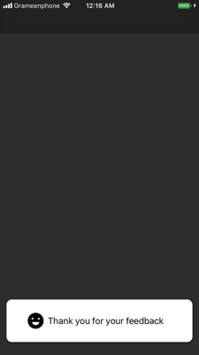

<h1 align="center"> Custom Toast Notifier </h1>
<p align="center">


</a>
</p>

A simple toast notifier to show user any message with custom background, image and text. Very simple implementation with limited options that are easy to extend and customize.

### Features
- [x] Simple message presentation with optional image.
- [x] Easy to customize.
- [x] Automatic disappearance.
- [x] Swift 4+.

<div align = "center">

</div>

## Usage

- To Present

```swift
JHToasterPresenter.present(in view: UIView, with image: UIImage?, with text: String?, where backgroundColor: UIColor?)
```
## Installing

#### Manually

Download and add `JHToaster.swift` file in your project. 
Or create a new file in your project and paste the code of `JHToaster.swift`.

## Requirements

* Swift 4+
* iOS 11 or higher

## Authors

* [**Jahid Hasan Polash**](https://github.com/jahid-hasan-polash)

## Communication

* If you **found a bug**, open an issue.
* If you **have a feature request**, open an issue.
* If you **want to contribute**, submit a pull request.

## License

This project is licensed under the MIT License.
